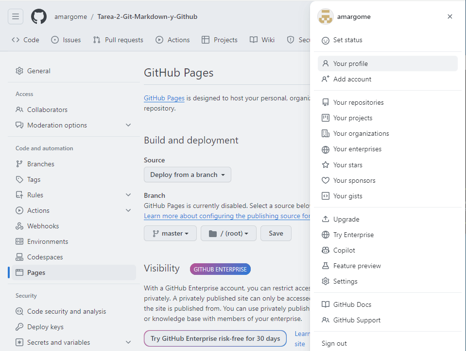
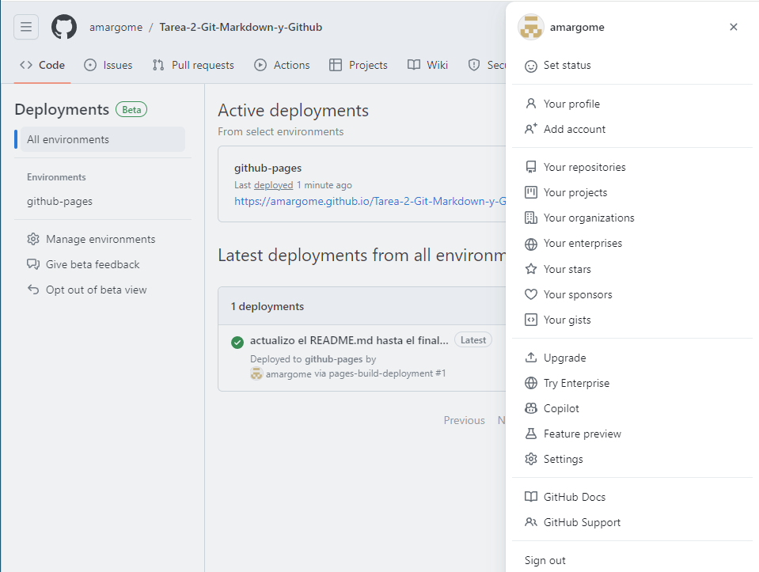
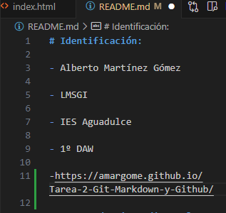

# Identificación:

- Alberto Martínez Gómez

- LMSGI 

- IES Aguadulce

- 1º DAW

-https://amargome.github.io/Tarea-2-Git-Markdown-y-Github/

#### Uso de Git mediante la terminal git bash. Las instrucciones y sus resultados deben mostrar como bloques de código markdown:

- Creación del repositorio en - nuestro ordenador (init) 

``` 
$ mkdir LMSGI_Tarea2
$ cd LMSGI_Tarea2/
$ git init
Initialized empty Git repository in C:/Users/maniana/Downloads/LMSGI_Tarea2/.git/
```

- Creación de un commit inicial (add, status, commit, log)

``` 
$ git add .

$ git status
On branch master

No commits yet

Changes to be committed:
  (use "git rm --cached <file>..." to unstage)
        new file:   README.md
        new file:   index.html
        new file:   informacion.html
        new file:   principal.html
        new file:   productos.html
        new file:   style.css
```
```
$ git commit -m 'añado 4 archivos html, 1 css y el README correspondiente a ellos'
[master (root-commit) 2bcb1cb] añado 4 archivos html, 1 css y el README correspondiente a ellos
 6 files changed, 99 insertions(+)
 create mode 100644 README.md
 create mode 100644 index.html
 create mode 100644 informacion.html
 create mode 100644 principal.html
 create mode 100644 productos.html
 create mode 100644 style.css
 ```
 ```
$ git log --oneline
2bcb1cb (HEAD -> master) añado 4 archivos html, 1 css y el README correspondiente a ellos

```

- Creación del repositorio en Github


- Añadir el remoto al repositorio local (branch, remote)
```
git remote add origin https://github.com/amargome/Tarea-2-Git-Markdown-y-Github.git
```

- Subir el repositorio a Github (push) y

```
$ git push -u origin master
Enumerating objects: 6, done.
Counting objects: 100% (6/6), done.
Delta compression using up to 12 threads
Compressing objects: 100% (5/5), done.
Writing objects: 100% (6/6), 1.13 KiB | 1.13 MiB/s, done.
Total 6 (delta 1), reused 0 (delta 0), pack-reused 0
remote: Resolving deltas: 100% (1/1), done.
To https://github.com/amargome/Tarea-2-Git-Markdown-y-Github.git
 * [new branch]      master -> master
branch 'master' set up to track 'origin/master'.
```

- Comprobar que está subido a Github.


#### Publicación en Github Pages:

- Modificar el repositorio para que sea público.

- Configurar el repositorio para que publique el directorio raíz en Github Pages.



- Mostrar los despliegues deployments.



- Mostrar la página web.

- Añadir en el primer apartado, Identificación, el enlace a la publicación del sitio web.



- Uso de Git mediante la interfaz de VSCode:

- Creación de otro commit,

- Subir el repositorio a Github,

- Comprobar que está subido a Github y

- Ver el listado de commit desde Github.