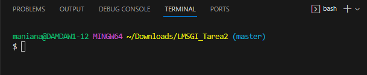
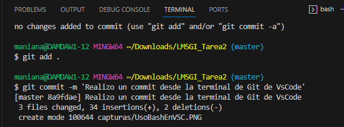
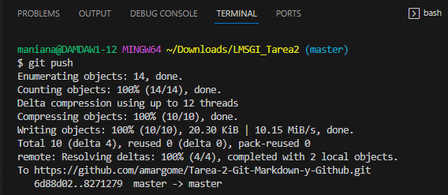
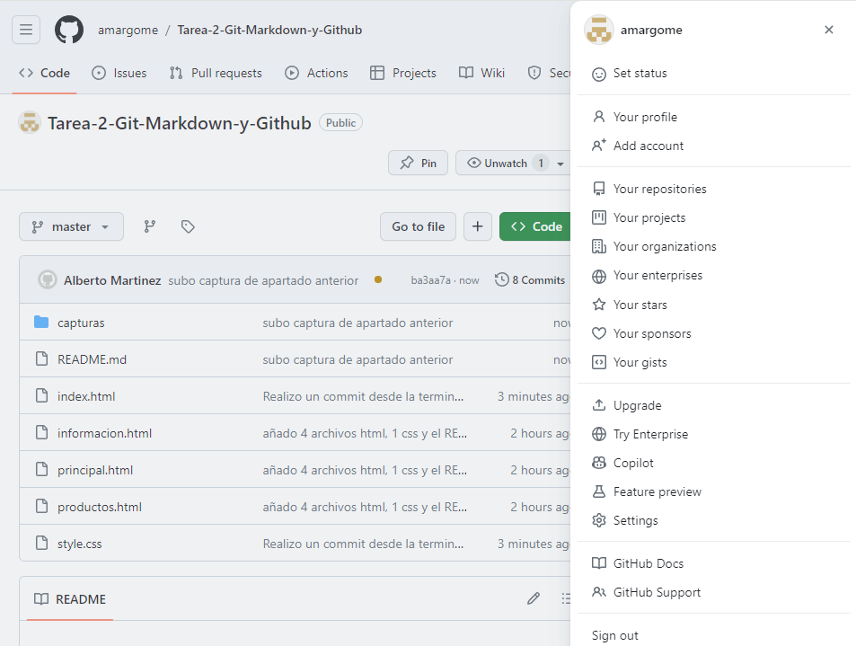
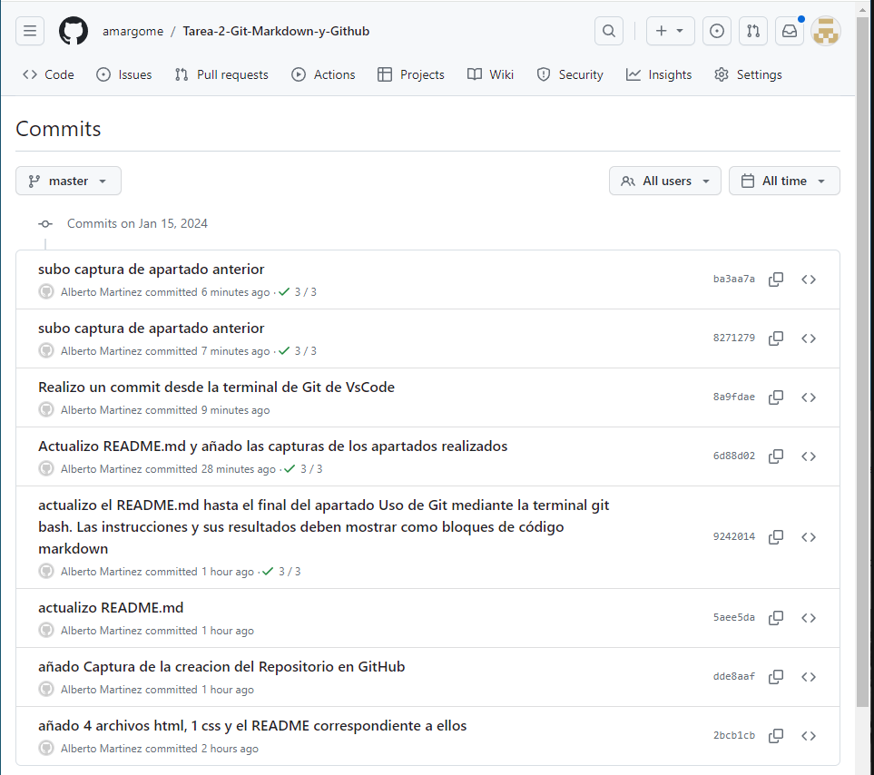

# Identificación:

- Alberto Martínez Gómez

- LMSGI 

- IES Aguadulce

- 1º DAW

![Enlace a página web]https://amargome.github.io/Tarea-2-Git-Markdown-y-Github/

#### Uso de Git mediante la terminal git bash. Las instrucciones y sus resultados deben mostrar como bloques de código markdown:

- Creación del repositorio en - nuestro ordenador (init) 

Usaremos los siguientes comandos para ello:

` mkdir + NombreCarpeta `` -> Con este comando crearemos la carpeta y le pondremos nombre.

` cd + NombreCarpeta ` -> Con este comando entraremos en la carpeta seleccionada.

` git init `-> Gracias a este comando inicializaremos el repositorio de git si usamos git init + NombreCarpeta se creara la carpeta de git automáticamente.

``` 
$ mkdir LMSGI_Tarea2
$ cd LMSGI_Tarea2/
$ git init
Initialized empty Git repository in C:/Users/maniana/Downloads/LMSGI_Tarea2/.git/
```

- Creación de un commit inicial (add, status, commit, log)

Usaremos los siguientes comandos para ello:

` git add . / git add + NombreAAñadir ` -> Con este comando añadiremos todos los archivos del repositorio o un archivo en especifico dependiendo de cual de los dos comandos.

` git status ` -> Con este comando veremos el estado de los archivos del repositorio, si están añadidos al "carrito" o si están "comiteados".

``` 
$ git add .

$ git status
On branch master

No commits yet

Changes to be committed:
  (use "git rm --cached <file>..." to unstage)
        new file:   README.md
        new file:   index.html
        new file:   informacion.html
        new file:   principal.html
        new file:   productos.html
        new file:   style.css
```
` git commit -m 'Mensaje del commit' ` -> Con este comando guardaremos los archivos subidos anteriormente en el "carrito".

```
$ git commit -m 'añado 4 archivos html, 1 css y el README correspondiente a ellos'
[master (root-commit) 2bcb1cb] añado 4 archivos html, 1 css y el README correspondiente a ellos
 6 files changed, 99 insertions(+)
 create mode 100644 README.md
 create mode 100644 index.html
 create mode 100644 informacion.html
 create mode 100644 principal.html
 create mode 100644 productos.html
 create mode 100644 style.css
 ```
` git log / git log --oneline ` -> Con el primer comando veremos el historial de commits de forma completa y con el segundo comando lo veremos con menos detalle.

 ```
$ git log --oneline
2bcb1cb (HEAD -> master) añado 4 archivos html, 1 css y el README correspondiente a ellos

```

- Creación del repositorio en Github

Entraremos en github y le daremos al botón verde de "New" para entrar en la pestaña de creación de repositorios, en esta pestaña configuraremos el repositorio y podremos añadir colaboradores si hay.


- Añadir el remoto al repositorio local (branch, remote)

En este caso como no crearemos ningun branch usaremos directamente el remote otorgado opr github para crear la conexión para la subida de los archivos al repositorio de github.

```
git remote add origin https://github.com/amargome/Tarea-2-Git-Markdown-y-Github.git
```

- Subir el repositorio a Github (push) y

Con el comando git push haremos que git suba los archivos de nuestro repositorio del dispositivo a la web de github.

```
$ git push -u origin master
Enumerating objects: 6, done.
Counting objects: 100% (6/6), done.
Delta compression using up to 12 threads
Compressing objects: 100% (5/5), done.
Writing objects: 100% (6/6), 1.13 KiB | 1.13 MiB/s, done.
Total 6 (delta 1), reused 0 (delta 0), pack-reused 0
remote: Resolving deltas: 100% (1/1), done.
To https://github.com/amargome/Tarea-2-Git-Markdown-y-Github.git
 * [new branch]      master -> master
branch 'master' set up to track 'origin/master'.
```

- Comprobar que está subido a Github.

Entrado en el repositorio de GitHub podremos verificar los cambios.


#### Publicación en Github Pages:

- Configurar el repositorio para que publique el directorio raíz en Github Pages.

Entraremos al apartado de "Settings" de GitHub para despues ir a "Pages" aqui cambiaremos el directorio que queremos publicar y guardaremos para hacerlo.


- Mostrar los despliegues deployments.

Dentro del mismo repositorio en el lateral derecho de la página podremos ver un apartado de deployments en el cual entraremos para verlos.


- Mostrar la página web.

- Añadir en el primer apartado, Identificación, el enlace a la publicación del sitio web.


- Uso de Git mediante la interfaz de VSCode:

En la parte superior de VSCode le daremos a terminal -> New Terminal , para posteriormente darle a la flechita a la derecha de "bash +" para escoger la opción de Git. 



- Creación de otro commit,

Usaremos el comando de git commit -m 'Mensaje del commit' para crear otro commit



- Subir el repositorio a Github,

Con el comando de git push subiremos el repositorio a GitHub.



- Comprobar que está subido a Github y

Entraremos al repositorio para verificar las actualizaciones hechas o para ver si se ha subido correctamente el repositorio si es la primera vez.



- Ver el listado de commit desde Github.

Dentro del repositorio hay un boton de "Commits" al lado del último commit hecho.

